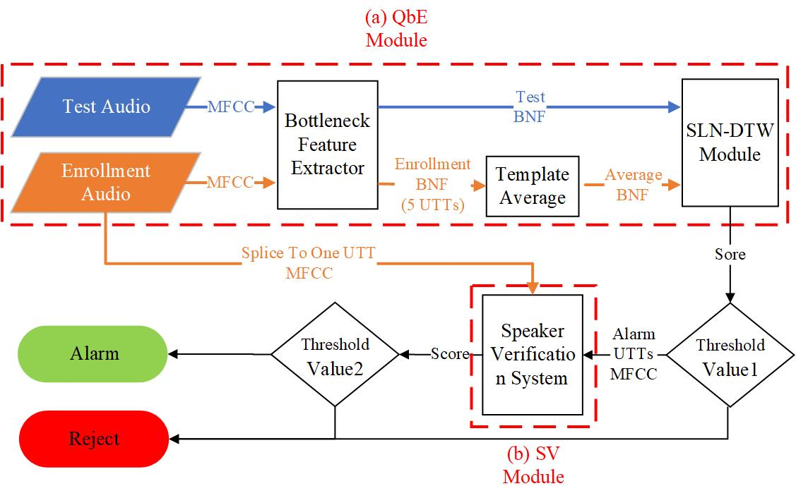

This is the baseline system for Auto-KWS 2021 Challenge, for details you can visit https://www.4paradigm.com/competition/autospeech2021

Our baseline method consists of a query by example (QbyE) system and a speaker verification (SV) system. QbyE is one of the text-independent wake-up systems, which we can use any speech as wake-up words without model retrain. This system consists of a bottleneck feature extractor, a template average module, and SLN-DTW module. If the output score from SLN-DTW is bigger than threshold value1, we use the SV module to re-verify. Specifically, we Splice the enrollment audios together to a long audio, and then by comparing the speaker vector similarity (by cosine distance) of the long audio and wake-up audios, we can decide whether to wake up finally.

The figure below shows the structure of baseline method:

For codes, here is what you need to know:
## No need to be submitted:
- run_bnf_extractor.sh: for training a bottleneck feature extractor by Kaldi recipe. The trained model is in root_dir/exp/ bnf_extractor, so you needn’t run this script to train the model again if you only want to run the baseline for the test.
- run_xvector_extractor.sh: for training the speaker verification model by Kaldi recipe. The trained model is in root_dir/exp/ xvector_extractor. As above mentioned, you needn’t run this script to train the model again if you only want to run the baseline for the test.

## Need to be submitted:
- initialize.sh: for preparing your environment.
- enrollment.sh: you need to process the input source enrollment data of one speaker here. The input-dir is like practice/P0001/enroll. And the output-dir is used to store what you need for predict.sh. Here are no mandatory requirements, except the output-dir must be named by the speaker.
- predict.sh: you need to process the input source test data of one speaker here. The input-dir is like practice/P0001/test. The output-dir must be named by the speaker. And the result file must in the spk/result dir and named wake_up_result. The result-file has two columns, the first column is utterance-id and the second is the wake-up result (1 is wake up and 0 is not)
- STD_v5 dir: an open-source dynamic time warping (DTW) algorithm library, for details you can visit https://github.com/jingyonghou/XY_QByE_STD
- steps, utils, and other Kaldi-related code dir.
